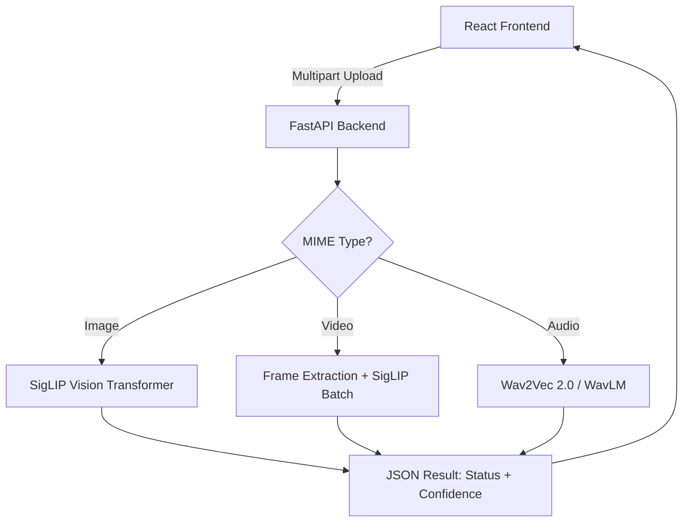

# Real AI-Backed Deepfake Detection Plan

The user requested to use **pre-trained models** for deepfake detection. We will transition from a simulated frontend experience to a functional **Python Backend (FastAPI)** that runs state-of-the-art vision and audio models from Hugging Face.

## Proposed Architecture

## Proposed Changes

### 1. Backend Setup
#### [NEW] `backend/requirements.txt`
- `fastapi`, `uvicorn`, `python-multipart`
- `transformers`, `torch`, `torchvision`, `torchaudio`
- `pillow`, `opencv-python-headless`, `librosa`, `soundfile`

#### [NEW] `backend/main.py`
- FastAPI server setup with CORS enabled (to allow React frontend access).
- Route `POST /api/detect` to handle multi-part file uploads.
- Route mapping based on file extension/MIME type.

#### [NEW] `backend/detectors.py`
- **Image Detector:** Load `prithivMLmods/Deepfake-Detect-Siglip2` from Hugging Face.
- **Audio Detector:** Load `MelodyMachine/Deepfake-audio-detection-V2` or similar speech-authenticity model.
- **Video Detector:** Use OpenCV to extract keyframes (e.g., 1 per second) and run the Image Detector on the batch, averaging the scores.

### 2. Frontend Integration
#### [MODIFY] [Engine.jsx](file:///d:/hackathon/Ignition-Hackverse-DecodeX-/react-app/src/pages/Engine.jsx)
- Update `runAnalysis` function to perform a `fetch` request to the backend instead of using `Math.random()`.
- Keep the "Micro-logs" HUD but populate it with real status updates from the fetch lifecycle (Uploading -> Analyzing -> Finished).

## User Review Required

> [!CAUTION]
> **Resource Requirements:** Running these pre-trained models (especially Video/Audio) requires significant RAM (~4GB+) and ideally a GPU (CUDA) for speed. If running on a CPU-only laptop, video analysis may take 30-60 seconds.

> [!IMPORTANT]
> **Backend Execution:** You will need to install the Python requirements and keep a second terminal running the FastAPI server (`uvicorn main:app --reload`) alongside your React dev server.

## Open Questions
1. **Model Size:** Do you want me to prioritize the **most accurate** models (heavier) or **fastest** models (lighter)?
2. **Setup:** Would you like me to create a shell script (`setup.sh` or `setup.ps1`) to automate the dependency installation for the backend?

## Verification Plan
1. Start FastAPI backend on port 8000.
2. Upload a known authentic image → Verify "AUTHENTIC" result.
3. Upload a known deepfake image → Verify "SYNTHETIC" result.
4. Verify that video frames are correctly extracted and analyzed in the backend logs.
