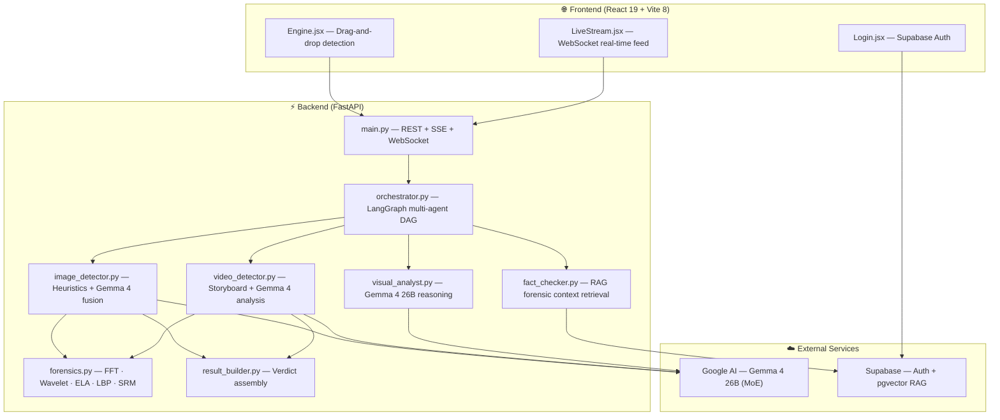
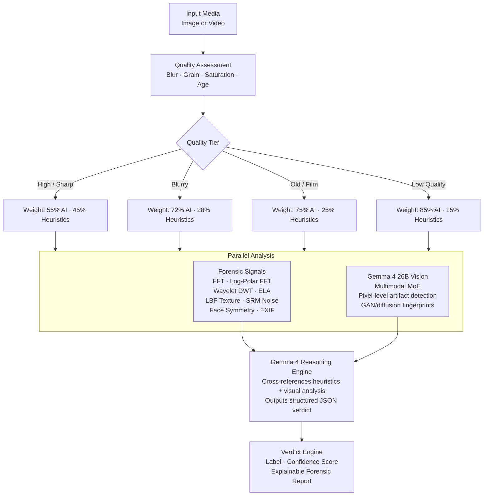

<p align="center">
  
  
</p>

<h1 align="center">🛡️ V-Auth — AI-Powered Deepfake Detection Platform</h1>

<p align="center">
  <b>Decode what's real. Expose what's not.</b><br/>
  A forensic-grade deepfake detection engine powered by <b>Gemma 4 26B</b> — built for <b>Gemma 4 Good Hackathon</b>
</p>

<p align="center">
  
  
  
  
  
  
  
  
  
</p>

---

## 🧠 What is V-Auth?

**V-Auth** is a real-time deepfake detection platform powered by **Gemma 4 26B (Multimodal MoE)**. It combines Gemma 4's native vision reasoning with multi-signal forensic heuristics (FFT, Wavelet, ELA, LBP, SRM, face geometry) to determine whether an image or video is authentic or synthetically generated.

Unlike black-box detectors, V-Auth uses a **Gemma 4-centric ensemble architecture**: forensic signals are extracted mathematically, but the final verdict and explanation come from Gemma 4's multimodal reasoning — producing transparent, explainable results. A LangGraph multi-agent workflow orchestrates CV engines, a Gemma 4 Visual Analyst, and a RAG-based Fact-Checker.

---

## ✨ Key Features

### 🔍 Image Detection Engine
- **Gemma 4 26B Multimodal Reasoning** — `google.gemini` SDK calls `gemma-4-26b-a4b-it` with image + heuristic context for structured forensic verdict
- **FFT Spectral Analysis** — Detects periodic checkerboard artifacts from GAN/Diffusion upsampling
- **Log-Polar FFT** — Converts radial artifacts into detectable linear patterns
- **Wavelet Noise (DWT)** — Identifies unnaturally smooth sub-band energy (Daubechies-2)
- **Error Level Analysis (ELA)** — Detects local compression inconsistencies
- **LBP Texture Forensics** — Measures micro-texture regularity in synthetic skin/surfaces
- **SRM Noise Residuals** — Geometric noise fingerprint analysis
- **Face & Iris Forensics** — MediaPipe landmark symmetry + bilateral iris consistency
- **EXIF Metadata Scoring** — Penalizes images lacking authentic camera metadata

### 🎬 Video Detection Engine
- **Gemma 4 26B Temporal Analysis** — Same model as image; analyzes multi-frame storyboard for temporal consistency
- **Keyframe Sampling** — Extracts up to 8 frames at 1 FPS via OpenCV for storyboard construction
- **Per-Frame Heuristics** — FFT, ELA, LBP, SRM, Wavelet, and face alignment extracted per frame
- **Gemma 4 Storyboard Fusion** — Frames composited into a grid; Gemma 4 evaluates cross-frame flicker, texture drift, and lip-sync consistency
- **Temporal Flicker Detection** — Measures forensic signature variance across the timeline as additional signal

### 🧬 Quality-Aware Adaptive Fusion
The engine automatically detects image quality tiers and rebalances signal weights:

| Quality Tier | AI Model Weight | Heuristic Weight | Rationale |
|:---|:---:|:---:|:---|
| **High** (sharp, modern) | 55% | 45% | Balanced — all signals reliable |
| **Blurry** | 72% | 28% | Frequency analysis unreliable on blur |
| **Old / Film** | 75% | 25% | Film grain mimics AI noise patterns |
| **Low Quality** | 85% | 15% | Trust the model almost exclusively |

### 🖥️ Frontend Dashboard
- **Landing Page** — Monochrome-themed with animated hero section
- **Detection Engine** — Drag-and-drop upload for images & videos with real-time analysis
- **Dashboard Overview** — Scan history and aggregate statistics
- **Live Stream Monitor** — Real-time forensic feed with manual start/stop controls
- **Settings Panel** — User preferences and configuration
- **Authentication** — Supabase-powered authentication with persistent user sessions, forgot password & reset functionality

---

## 🏗️ Architecture



---

## 🚀 Getting Started

### Prerequisites

- **Python 3.10+** with pip
- **Node.js 18+** with npm
- **Google AI API key** — set as `GOOGLE_API_KEY` in `.env`

### 1. Clone the repository

```bash
git clone https://github.com/Krishna-1416/Ignition-Hackverse-DecodeX-.git
cd Ignition-Hackverse-DecodeX-
```

### 2. Start the Backend

```bash
cd backend
pip install -r requirements.txt
python main.py
```

The server initializes the Gemma 4 forensic engine and listens at **`http://localhost:8000`**.

> ⚡ **Requires a `GOOGLE_API_KEY`** in your `.env` file (Gemma 4 is accessed via Google AI Studio API). No local model weights needed.

### 3. Start the Frontend

```bash
cd frontend
npm install
npm run dev
```

Opens at **`http://localhost:5173`**.

### ☁️ Deployment Guides

- **Backend (Render):** A `render.yaml` configuration is included to seamlessly deploy the FastAPI service on Render as a Web Service.
- **Frontend (Vercel):** The included `vercel.json` and React router setup directly map to Vercel's SPA routing. Run `python setup_vercel.py` or import the project directory to automatically deploy.

---

## 📡 API Reference

### `GET /health`
Liveness probe — confirms the server and models are ready.

```json
{ "status": "healthy", "timestamp": 1717000000.0 }
```

### `POST /analyze`
Upload an image or video for deepfake analysis. Returns a `task_id` for polling via SSE.

**Request:** `multipart/form-data` with a `file` field (optional `query` text)  
**Max file size:** 100 MB  
**Supported formats:**
- **Images:** JPEG, PNG, WebP, BMP
- **Videos:** MP4, MOV, WebM

**Response (SSE stream at `/events/{task_id}`):**
```json
{
  "status": "Complete",
  "result": {
    "prediction": "Authentic / Real",
    "confidence": 0.8745,
    "explanation": "Gemma 4 forensic report explaining the verdict...",
    "breakdown": {
      "model_score": 0.123,
      "diffusion_score": 0.089,
      "manipulation_score": 0.045,
      "realism_score": 0.891,
      "fourier_spectral": 0.067,
      "ela_score": 0.032,
      "texture_score": 0.021,
      "noise_score": 0.045,
      "wavelet_sig": 0.034,
      "iris_consistency": 0.012,
      "geometric_alignment": 0.023,
      "image_quality": 0.945
    }
  }
}
```

---

## 🧪 How Detection Works



---

## 🛠️ Tech Stack

| Layer | Technology | Purpose |
|:---|:---|:---|
| **Multimodal AI** | Gemma 4 26B (`google-genai` SDK) | Native vision + heuristic fusion forensic reasoning |
| **Agent Orchestration** | LangGraph | Multi-agent DAG: CV → Visual Analyst → Synthesis |
| **RAG / Knowledge Base** | Supabase pgvector + `google-embedding-2` | Forensic knowledge retrieval |
| **Frontend** | React 19, Vite 8, React Router 7 | SPA with monochrome forensic UI |
| **Backend** | FastAPI, Uvicorn | Async REST API with SSE streaming |
| **Computer Vision** | OpenCV, MediaPipe | Frame extraction, face mesh landmarking |
| **Signal Processing** | NumPy, SciPy, PyWavelets | FFT, DWT, spectral analysis |
| **Metadata** | Piexif, Pillow | EXIF parsing, image I/O |
| **Authentication** | Supabase API | Secured persistent user accounts, session handling |
| **Deployment** | Vercel, Render | Frontend CDN + Serverless Backend hosting |

---

## 📄 License

MIT License — see the [LICENSE](LICENSE) file for details.

---

<p align="center">
  Built with 🧠 and ☕ by <b>Team DecodeX</b> for <b>Gemma 4 Good Hackathon 2026</b>
</p>
